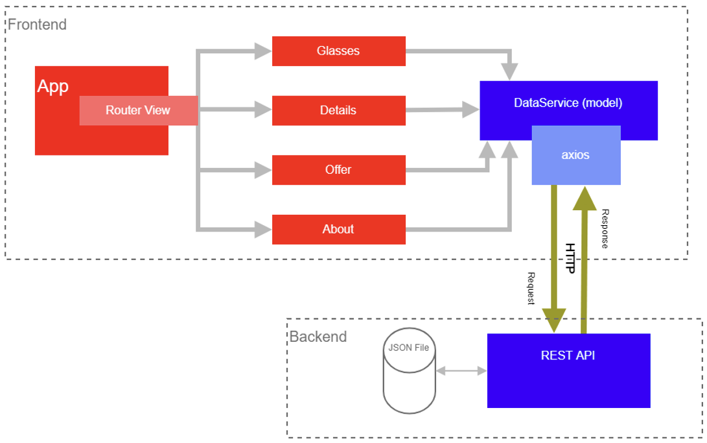
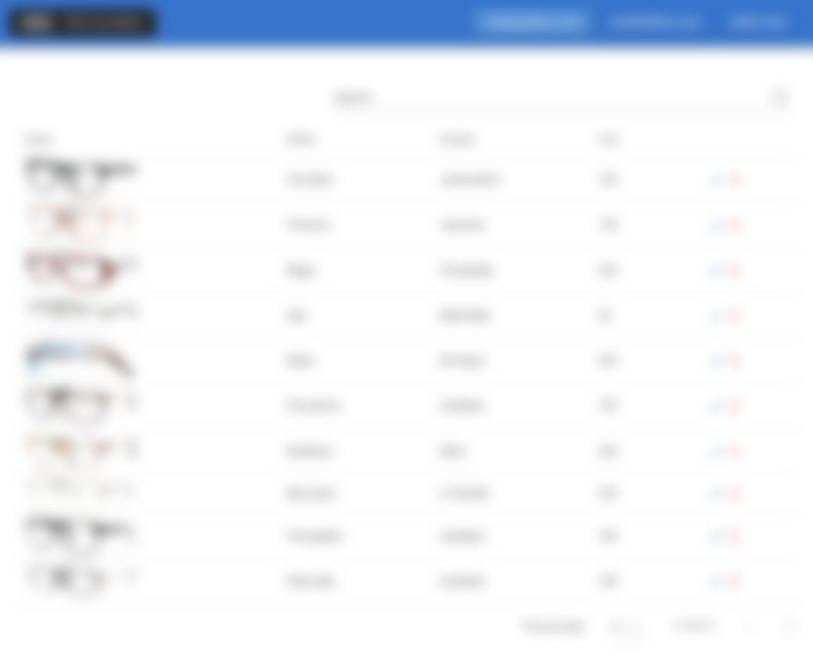

<table class="no-border">
<tr><td><b>Lorem ipsum:</b></td><td>Lorem ipsum dolor sit amet, consectetur adipiscing elit</td><td></td><td style="text-align: right;"><b>Lorem:</b> Lorem ipsum 0000/00</td></tr>
<tr><td></td><td>Lorem ipsum dolor sit amet, consectetur adipiscing elit</td><td></td><td style="text-align: right;"><b>Lorem:</b> Lorem ipsum</td></tr>
<tr><td><b>Lorem ipsum:</b></td><td>000</td><td></td><td></td></tr>
</table>
<br><br>
<h1 style="font-family:Arial;font-weight: 400;color:red;">LOREM IPSUM DOLOR SIT AMET</h1>

<h1 style="font-family:Arial;font-weight: 400;color:red;">LOREM IPSUM DOLOR SIT</h1>

<br>

<u><b>Lorem ipsum:</b></u>

<br>

<u>Lorem 1:</u>

<br>

Lorem ipsum dolor sit amet, consectetur adipiscing elit. Sed do eiusmod tempor incididunt ut labore et dolore magna aliqua. Ut enim ad minim veniam, quis nostrud exercitation ullamco laboris nisi ut aliquip ex ea commodo consequat.

Lorem ipsum dolor sit amet, consectetur adipiscing elit:

* Lorem ipsum dolor sit amet,
* Lorem ipsum dolor sit amet,
* Lorem ipsum dolor sit amet.
<br><br>

Lorem ipsum dolor sit amet, consectetur adipiscing elit. Sed do eiusmod tempor incididunt ut labore et dolore magna aliqua.

Lorem ipsum (Lorem) Lorem ipsum (Lorem):

<div style="text-align: center;">
  
</div>

Lorem ipsum dolor sit amet, consectetur adipiscing elit. Sed do eiusmod tempor incididunt ut labore et dolore magna aliqua. Ut enim ad minim veniam.

Lorem ipsum dolor sit amet (**Lorem**, **Lorem**).

Lorem ipsum dolor sit amet, consectetur adipiscing elit, sed do eiusmod tempor incididunt.

Lorem ipsum dolor sit amet (**Lorem, Lorem, Lorem, Lorem**).

Lorem ipsum (Lorem):

1. Lorem ipsum dolor sit amet (00)
<br>
    a) Lorem ipsum dolor sit amet, consectetur adipiscing elit.

    b) Lorem ipsum dolor sit amet, consectetur adipiscing elit.

    c) Lorem ipsum dolor sit amet, consectetur adipiscing elit.

    d) Lorem ipsum dolor sit amet.

    e) Lorem ipsum dolor sit amet.
<br>
<br>
1. Lorem ipsum dolor sit amet (000)

    a) Lorem ipsum dolor sit amet.

    b) Lorem ipsum dolor sit amet.

    c) Lorem ipsum dolor sit amet.

    d) Lorem ipsum dolor sit amet.

    e) Lorem ipsum dolor sit amet.

    f) Lorem ipsum dolor sit amet.

    g) Lorem ipsum dolor sit amet.

    h) Lorem ipsum dolor sit amet.
<br>
<br>
1. Lorem ipsum dolor sit amet (00)

    a) Lorem ipsum dolor sit amet.

    b) Lorem ipsum dolor sit amet.

    c) Lorem ipsum dolor sit amet.

<table class="api-table">
  <thead>
    <tr>
      <th>Lorem</th>
      <th>Lorem</th>
      <th>Lorem ipsum</th>
    </tr>
    <tr class="separator">
      <td colspan="3">
        <div class="separator-line"></div>
      </td>
    </tr>
  </thead>

  <tbody>
    <tr>
      <td>GET</td>
      <td><code>/lorem</code></td>
      <td>
        Lorem ipsum dolor sit amet, consectetur adipiscing elit.
        <code>lorem</code>, <code>ipsum</code>, <code>dolor</code>,
        <code>sit</code>, <code>amet</code>
      </td>
    </tr>
    <tr class="separator">
      <td colspan="3"><div class="separator-line"></div></td>
    </tr>
    <tr>
      <td>GET</td>
      <td><code>/lorem?ipsum=value</code></td>
      <td>
        Lorem ipsum dolor sit amet, consectetur adipiscing elit.
      </td>
    </tr>
    <tr class="separator">
      <td colspan="3"><div class="separator-line"></div></td>
    </tr>
    <tr>
      <td>GET</td>
      <td><code>/lorem/:id</code></td>
      <td>
        Lorem ipsum dolor sit amet.
      </td>
    </tr>
    <tr class="separator">
      <td colspan="3"><div class="separator-line"></div></td>
    </tr>
    <tr>
      <td>PUT</td>
      <td><code>/lorem/:id</code></td>
      <td>Lorem ipsum dolor sit amet.</td>
    </tr>
    <tr class="separator">
      <td colspan="3"><div class="separator-line"></div></td>
    </tr>
    <tr>
      <td>DELETE</td>
      <td><code>/lorem/:id</code></td>
      <td>Lorem ipsum dolor sit amet.</td>
    </tr>
    <tr class="separator">
      <td colspan="3"><div class="separator-line"></div></td>
    </tr>
    <tr>
      <td>POST</td>
      <td><code>/lorem</code></td>
      <td>
        Lorem ipsum dolor sit amet.
        <code>lorem</code>, <code>ipsum</code>,
        <code>dolor</code>, <code>sit</code>, <code>amet</code>
      </td>
    </tr>
  </tbody>
</table>

<br>
4. Lorem ipsum dolor sit amet (00)
<br>
<br>
<div style="margin-left: 1.5em;">
Lorem ipsum dolor sit amet, consectetur adipiscing elit. Sed do eiusmod tempor incididunt ut labore et dolore magna aliqua.
</div>
<br>
<br>

**Lorem ipsum dolor sit amet:**

<b><u>Lorem</u></b>

Lorem ipsum dolor sit amet, consectetur adipiscing elit. Sed do eiusmod tempor incididunt ut labore et dolore magna aliqua.

<div style="break-before: page;"></div>
<b><u>Lorem</u></b>

Lorem ipsum dolor sit amet, consectetur adipiscing elit. Sed do eiusmod tempor incididunt ut labore et dolore magna aliqua.

<div style="break-before: page;"></div>
<b><u>Lorem</u></b>

Lorem ipsum dolor sit amet, consectetur adipiscing elit.

Lorem ipsum:

Lorem ipsum dolor sit amet, consectetur adipiscing elit.

<div style="break-before: page;"></div>
<u>Lorem 2:</u>
<br>
<br>
Lorem ipsum dolor sit amet, consectetur adipiscing elit.

<u>Lorem ipsum:</u>

- Lorem ipsum dolor sit amet
- Lorem ipsum dolor sit amet
- Lorem ipsum dolor sit amet
<br><br><br><br><br>

**Lorem:**

**Lorem, Lorem, Lorem**

<br><br><br>
<table style="border-collapse:collapse;
  border:none;
  display:inline-table;
  width:50%">
  <tr>
    <td style="border:none; padding:6px; text-align:center; vertical-align:middle; border-top:1px solid #000;">
      Lorem ipsum dolor sit amet
    </td>
  </tr>
</table>
<br><br><br><br>
<table style="border-collapse:collapse;
  border:none;
  display:inline-table;
  width:100%">
  <tr>
    <td style="border:none; padding:6px;width:30%;"></td>
    <td style="border:none; padding:6px; text-align:center; vertical-align:middle; border-top:1px solid #000;">
      Lorem ipsum dolor sit amet
    </td>
    <td style="border:none; padding:6px;"></td>
    <td style="border:none; padding:6px; text-align:center; vertical-align:middle; border-top:1px solid #000;">
      Lorem ipsum dolor sit amet
    </td>
  </tr>
</table>
<br><br><br><br>
<table style="border-collapse:collapse;
  border:none;
  display:inline-table;
  width:100%">
  <tr>
    <td style="border:none; padding:6px;width:30%;"></td>
    <td style="border:none; padding:6px; text-align:center; vertical-align:middle; border-top:1px solid #000;">
      Lorem ipsum dolor sit amet
    </td>
  </tr>
</table>

<h1 style="break-before: page;font-family:Arial;font-weight: 400;color:red;">LOREM</h1>

<h2 style="color:red;font-weight: 400;">Lorem ipsum</h2>

<table style="border-collapse:collapse; width:100%; font-size:10px;">
  <tr>
    <td style="width:20%; padding:6px; vertical-align:top; font-weight:bold;">
      Lorem<br>Lorem
    </td>
    <td style="width:70%; padding:6px; vertical-align:top;">
      <strong>Lorem ipsum:</strong><br><br>
      • Lorem ipsum dolor sit amet<br>
      • Lorem ipsum dolor sit amet<br>
      • Lorem ipsum dolor sit amet<br>
      • Lorem ipsum dolor sit amet
    </td>
    <td style="width:10%; padding:6px; vertical-align:top; text-align:right;">
      <strong>00</strong><br><br>
      0<br>0<br>0<br>0
    </td>
  </tr>
</table>

<h2 style="break-before: page;font-weight: 400;color:red;">Lorem ipsum</h2>

```json
{
  "collection": [
    {
      "id": 9990001,
      "name": "Model Lorem",
      "targetGroup": "alpha",
      "frameMaterial": "material",
      "frontColor": "colorA",
      "templeColor": "colorB",
      "weight": "00.00",
      "price": 0.00,
      "designer": "Designer Lorem",
      "thumbnail": "9990001_t.jpg",
      "images": [
        "9990001_01.jpg",
        "9990001_02.jpg",
        "9990001_03.jpg"
      ]
    }
  ],
  "orders": [
    {
      "firstname": "Lorem",
      "lastname": "Ipsum",
      "city": "Lorem City",
      "email": "lorem@ipsum.test",
      "model": 9990001,
      "diobticL": -0.5,
      "diobticR": 0.5,
      "coated": false
    }
  ]
}
```

<h2 style="break-before: page; font-weight: 400;color:red;">Lorem ipsum</h2>
<br>
<br>
<u>Lorem List:</u>
<br><br>
<div style="text-align: center;">
  
</div>
